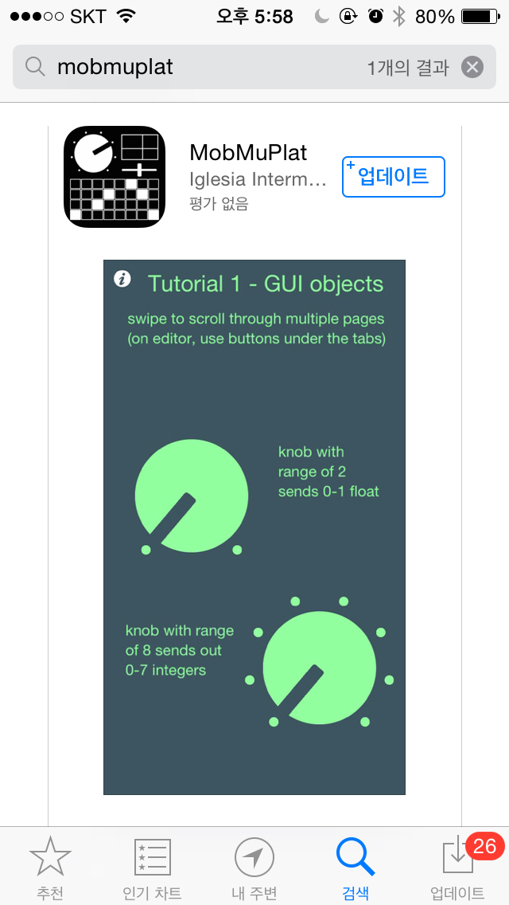

name: title
layout: true
class: center, blackwave, middle, title
---
name: content
layout: true
class: left, top, blackwave, content
.footnote[Manual: B-Y-O-P]
---
name: imgonly
layout: true
class: left, middle, blackwave, imgonly

.footnote[Manual: B-Y-O-P]
---
layout: false
template: title
#B-Y-O-P
##Bring Your Own Phone
##당신의 폰을 가져오세요
---
template: content
#BYOP(Bring Your Own Phone). 여기서 폰이란 스마트 폰을 말한다. 불이 꺼지면 새까맣고, 그래서 얼굴이 비치고, 이빨에 끼인 고춧가루를 확인할 수 있는 그 넙적한 그것 말이다. 스마트 폰은 이름부터가 못마땅하다. 폰이 그냥 폰이지 스마트할 껀 뭐람. 나보다 스마트해 보이는 그 녀석. 스마트 폰을 쓰는 사람은 스마트 한 걸까? 6자유도 센서와 나침반 센서를 내장하고, 위성과 통신

---

template: content

#하며 GPS로 내가 지금 어딜 바라보고 있는지 금세 알아맞히지만 화면이 꺼지면, 검은 스크린은 차가워서 얼음처럼 쨍하다.
#-우린 대화가 필요해! 나와 진짜로 연결되어 줘. 같이 놀자. 스마트한 ‘폰 놀이만’씨.

---
template: content

#과정과 일정

##6. 만든 이미지들을 발표, 모두 같이 보기 
##7. 각자 만들어낸 작업물을 비슷한 주제나 표현 방식끼리 
##3~5명 서로 묶어 한권의 책을 만듬 
###    이미지들이 서로 엮이면서 생기는 이야기들 살펴보기 (스토리텔링) 
###  책 표지, 폰트도 고르고
##8. 소책자를 발표하고 작업물 서로 보기

##1주 >> cover 1 2
##2주 >> cover 3 4 5 
##3주 >> cover 6 7
##4주 >> cover 8

---
template: imgonly

###솔직한 발견, 호기심

---

template: imgonly

###솔직한 발견, 호기심

---
template: imgonly

###솔직한 발견, 호기심

---
template: imgonly

###솔직한 발견, 호기심

---
template: imgonly

###솔직한 발견, 호기심

---
template: imgonly

###솔직한 발견, 호기심

---
template: imgonly

###솔직한 발견, 호기심

---
template: imgonly

###솔직한 발견, 호기심

---

template: content
#관찰 그리고 시선
#1. 일기 같이 접근해보는것도 좋고
#2. 낯설게 보기, 새롭게 보기 
#3. 일상의 풍경, 사람들에게 의외의 연상이미지를 덧붙여 작업
관찰 그리고 시선

---

template: content
#관찰 그리고 시선
#1. 일기 같이 접근해보는것도 좋고
##자주가는 가게 사람, 
##집까지 가는 길 관찰(시간순서를 넣어)
##매일 지나다니다 보면, 어떤날 특별한 사건이 발생할지도

##예를 들면, 

http://kerenpeng.com/Sketchbooks

http://kerenpeng.com/On-My-Way-Home

http://www.abouttoday.co.uk/Travel-Diaries

http://cargocollective.com/michellejchun/Cut-Outs

http://www.tipitin.com/shop/invasion-invasao-by-craig-atkinson

---

template: content
#관찰 그리고 시선
#2. 새롭게 보기 
## 관심 있는 열쇳말, 개념을 가지고 그것에 부합하는 것들만 찾아보기
##자주 출몰하는 고양이들, 강아지들 관찰하고 , 맵을 그려본다던지
##할머니 노숙자 여자들, 혹은 가방
##사람들(기준을 두고_옷잘입은 사람, 양복을 입는 사람, 오토바이타는 사람)
##특별한 풍경(철공소, 혹은 좁은 골목길)

##예를 들면, 

http://www.tizianajillbeck.de/indexhibit/index.php?/neu/casual-friday/

http://www.idnworld.com/creators/?id=GraceLee

http://www.masakokubo.co.uk/illustration/images/

---

template: content
#관찰 그리고 시선
#3. 일상의 풍경, 사람들에게 의외의 연상이미지를 덧붙여 작업
##전혀 다른 사람, 공간으로 상상하고 접근

##예를 들면, 
http://www.idnworld.com/creators/?id=JohnWoo

http://tinanded.com.au/projects/distant-colony/

http://tinanded.com.au/projects/united-eye/

http://palefroi.tumblr.com/

