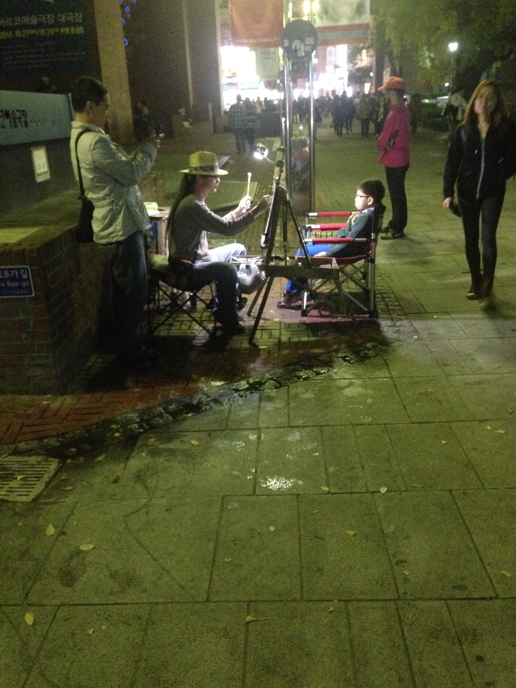

name: title
layout: true
class: center, blackwave, middle, title
---
name: content
layout: true
class: left, middle, blackwave, content
.footnote[anrchist-tool-box / 2nd research / performing_startup]
---
name: imgonly
layout: true
class: center, middle, blackwave, imgonly

.footnote[anrchist-tool-box / 2nd research / performing_startup]
---
layout: false
template: title
# 아나키스트 도구상자
##대학로에서 찾은 아나키스트들 
##노점상 사람들 타로,  점, 먹거리, 꽃
##버스킹하는 사람들 싱어송라이터, 타악기 연주자, 춤추는 그룹 
### 리서치 자료 10월 15일, 10월 26일

---
template: imgonly

###마로니에 공원에서 소규모 공연하는 사람들

---
template: imgonly

###마로니에 공원에서 소규모 공연하는 사람들

---
template: imgonly

###마로니에 공원에서 소규모 공연하는 사람들

---
template: imgonly

###마로니에 공원에서 소규모 공연하는 사람들

---
template: imgonly

###마로니에 공원에서 소규모 공연하는 사람들

---

template: content

