name: title
layout: true
class: center, blackwave, middle, title
---
name: content
layout: true
class: left, middle, blackwave, content
.footnote[Local people drawing / 2nd project / together binding]
---
name: imgonly
layout: true
class: center, middle, blackwave, imgonly

.footnote[/ 2nd project / together binding]
---
layout: false
template: title
# Local People Drawing 
#동네사람 드로잉
##_2nd Project
### 함께 엮는 독립출판 형식

---
template: content

---

template: content

# 아나키스트 도구상자
# #대학로에서 찾은 아나키스트들 
##노점상 사람들 타로,  점, 먹거리, 꽃
##버스킹하는 사람들 싱어송라이터, 타악기 연주자, 춤추는 그룹 

 
---
template: content

#과정과 일정

---
template: imgonly

###솔직한 발견, 호기심

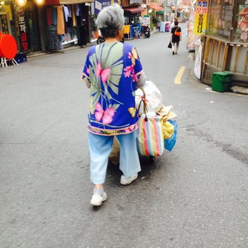
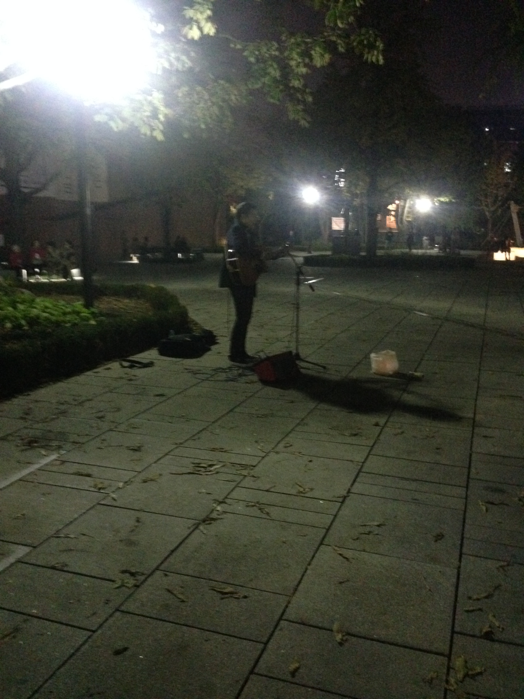
---

template: imgonly

###솔직한 발견, 호기심

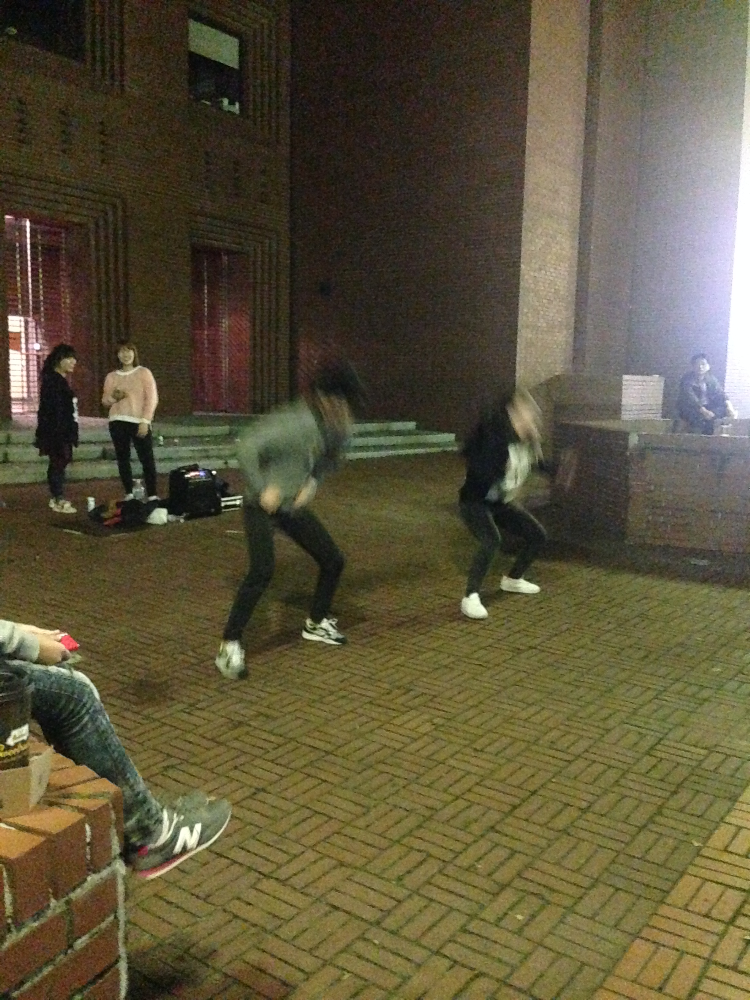
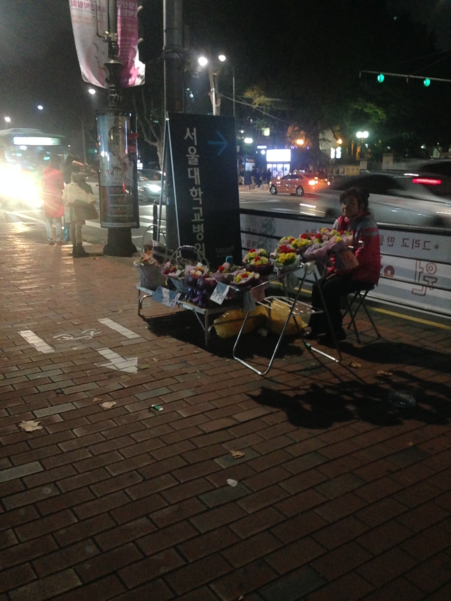

---
template: imgonly

###솔직한 발견, 호기심

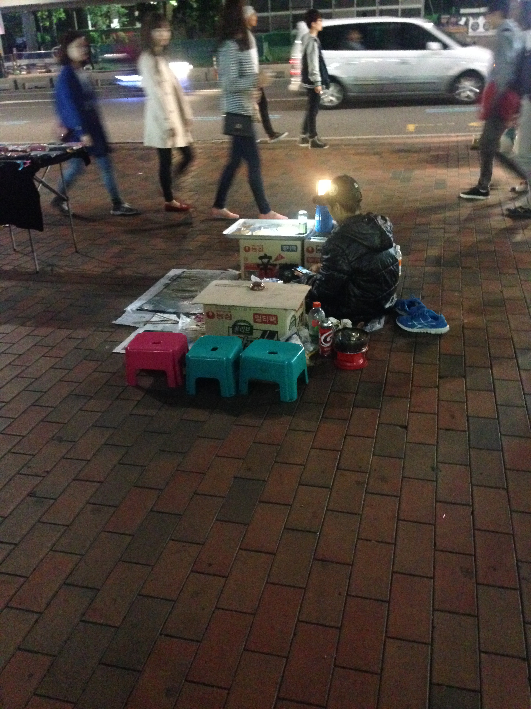

---
template: imgonly

###솔직한 발견, 호기심

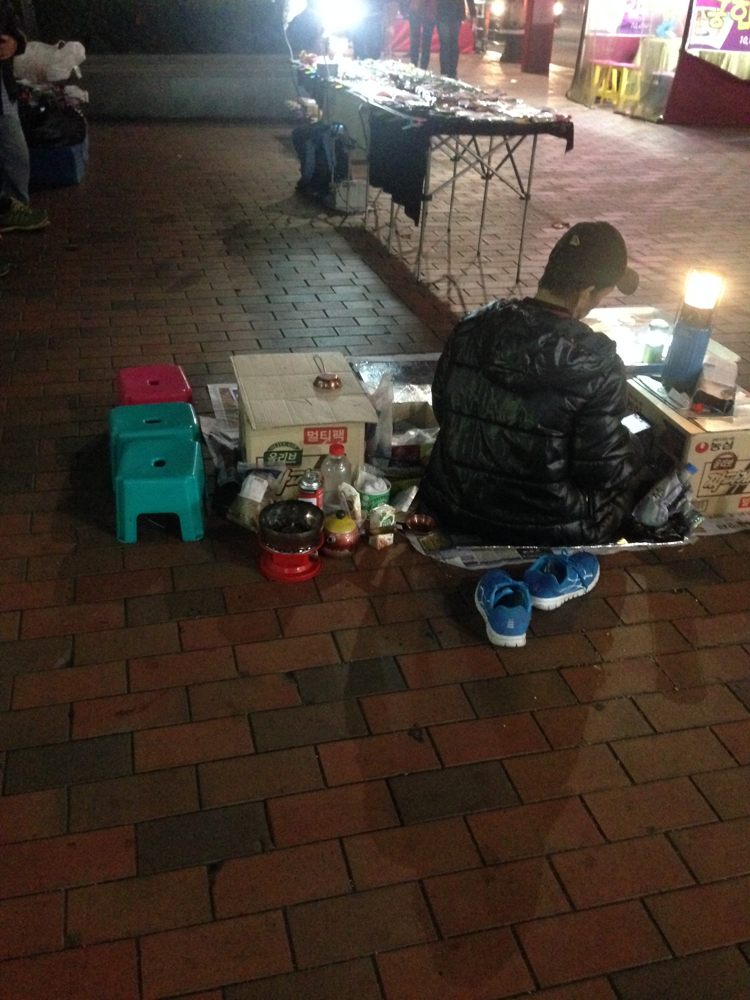

---
template: imgonly

###솔직한 발견, 호기심

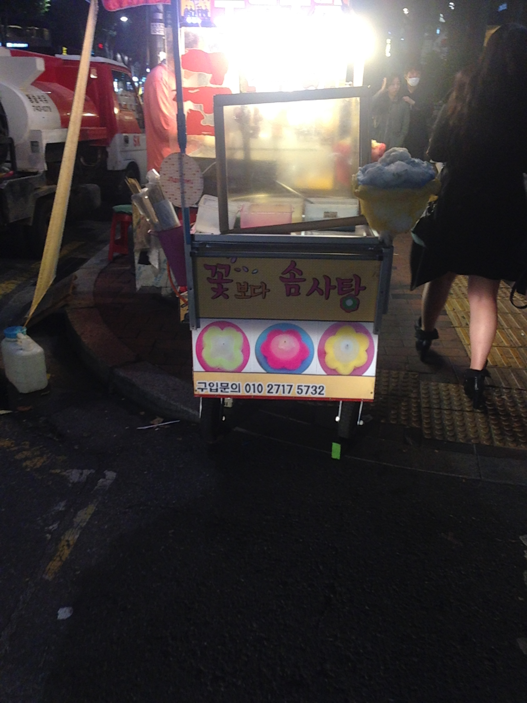
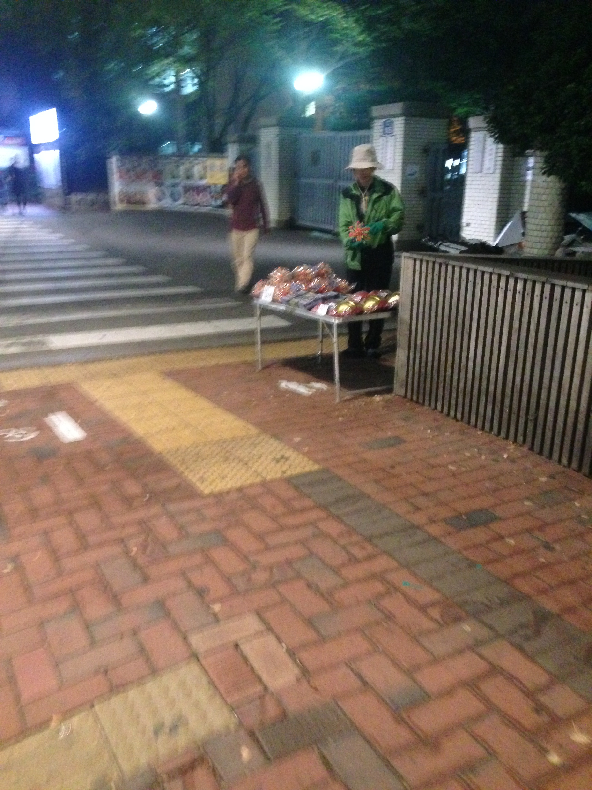

---
template: imgonly

###솔직한 발견, 호기심

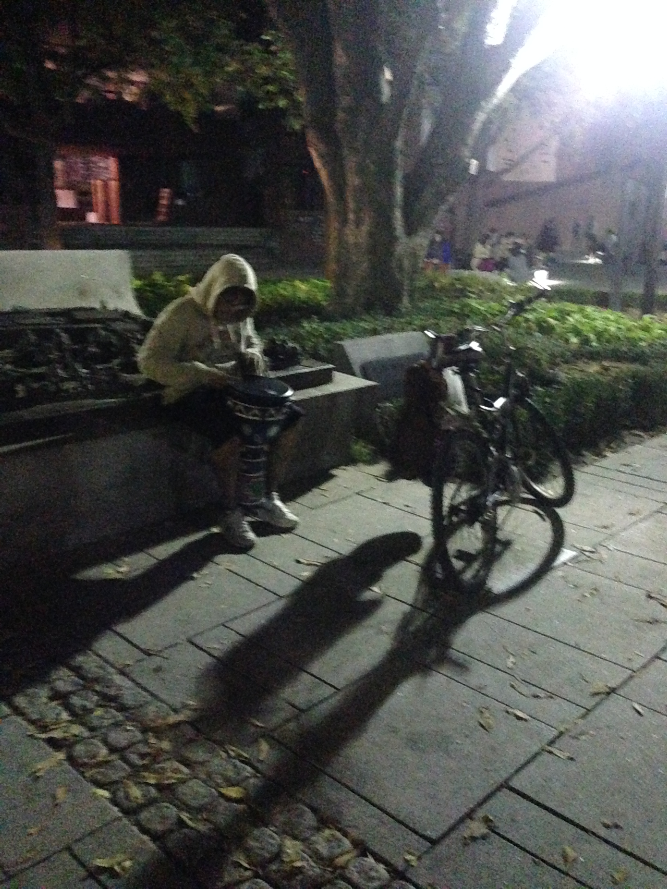

---
template: imgonly

###솔직한 발견, 호기심

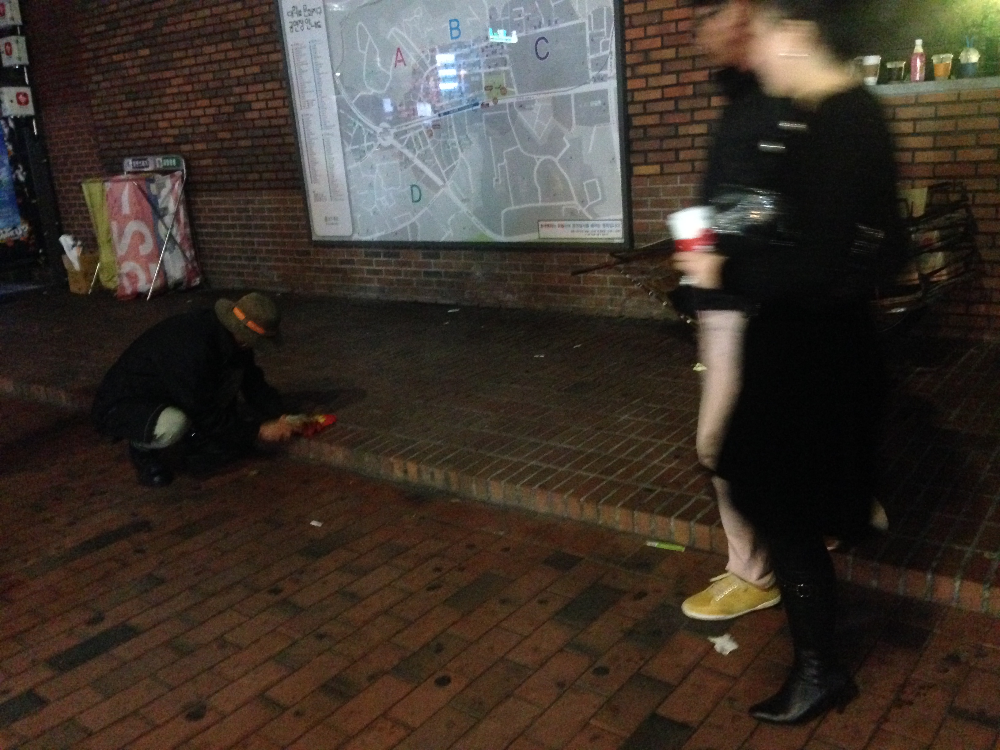

---
template: imgonly

###솔직한 발견, 호기심

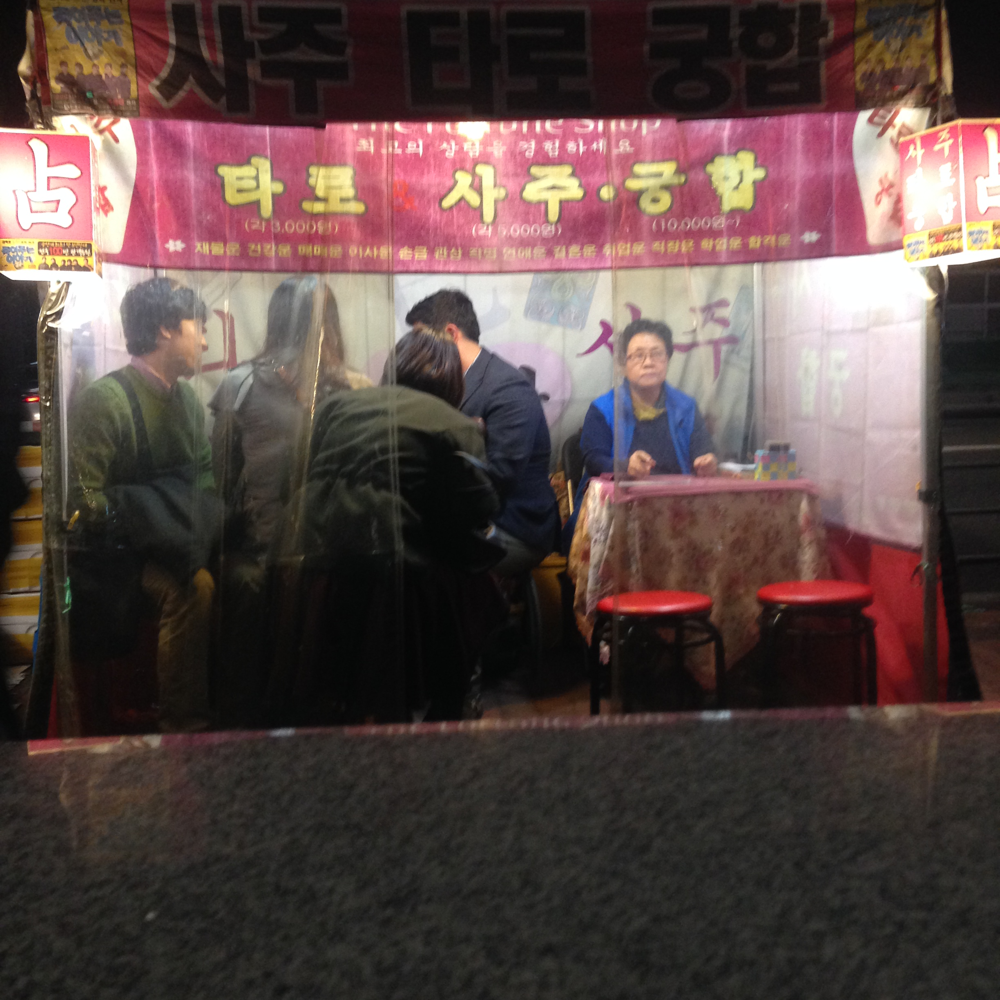

---

template: content

---

---

template: content
#관찰 그리고 시선
#2. 새롭게 보기 
## 관심 있는 열쇳말, 개념을 가지고 그것에 부합하는 것들만 찾아보기
##자주 출몰하는 고양이들, 강아지들 관찰하고 , 맵을 그려본다던지
##할머니 노숙자 여자들, 혹은 가방
##사람들(기준을 두고_옷잘입은 사람, 양복을 입는 사람, 오토바이타는 사람)
##특별한 풍경(철공소, 혹은 좁은 골목길)

##예를 들면, 

http://www.tizianajillbeck.de/indexhibit/index.php?/neu/casual-friday/

http://www.idnworld.com/creators/?id=GraceLee

http://www.masakokubo.co.uk/illustration/images/

---

template: content

