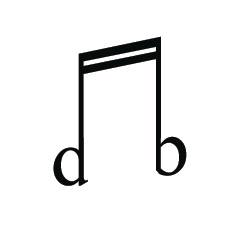
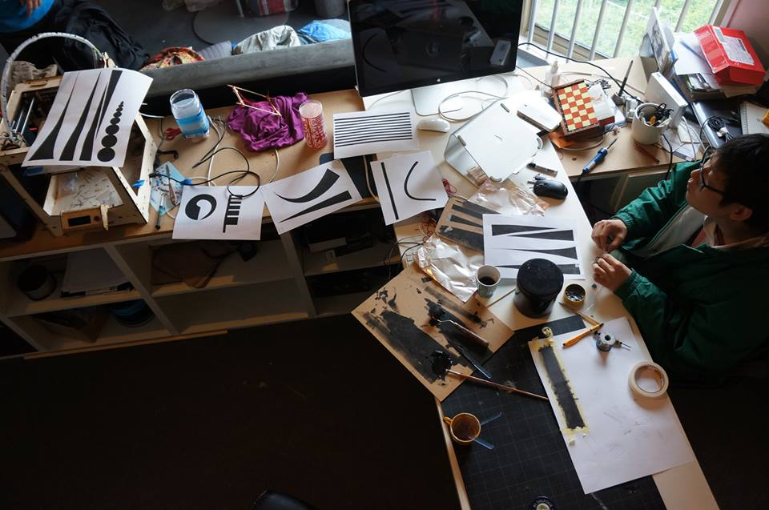
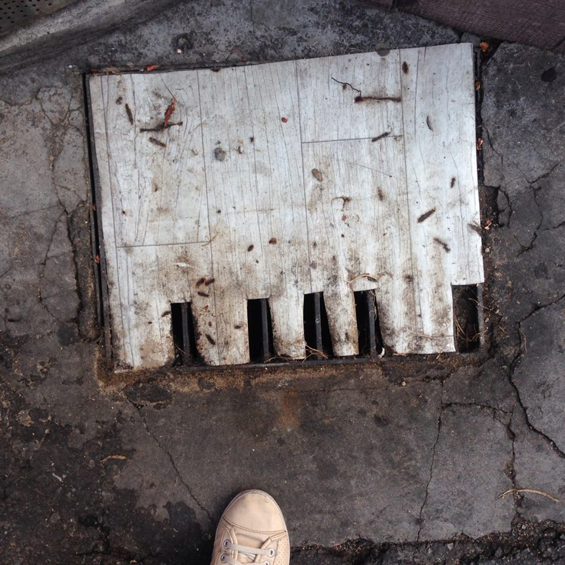
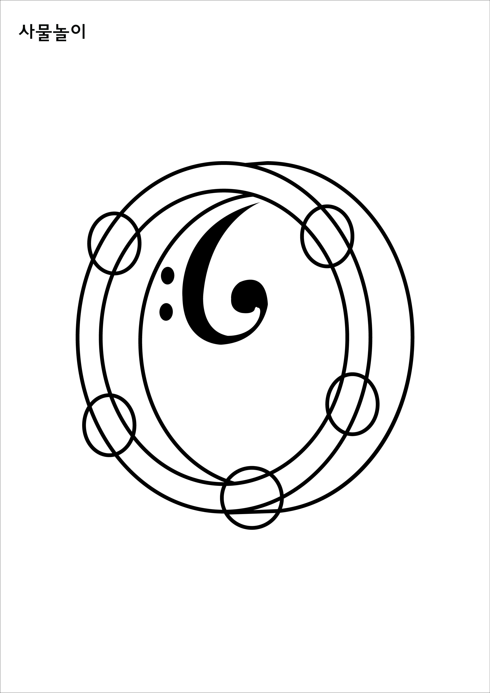

name: title
layout: true
class: center, blackwave, middle, title
---
name: content
layout: true
class: left, middle, blackwave, content
.footnote[oh-print / Printing Studio Show/ dianaband]
---
name: imgonly
layout: true
class: center, middle, blackwave, imgonly

.footnote[oh-print / Printing Studio Show/ dianaband]
---
layout: false
template: title
# 환영합니다

---
template: imgonly

---
template: imgonly

###<오!프린트>워크숍에서는 인쇄물에 소리를 결합하는 프린트 방법론을 소개한다. 
###전도성 잉크 혹은 흑연(연필)을 이용하여 제작되는 인쇄물에 특정한 전자장치가 연결되어, 
###이미지를 만질 때, 계획된 소리가 발생하게 하기 위한 일련의 제작과정을 소개한다. 또한, 
###워크숍 참여자는 간단한 전자 장치를 이용하여, 그래픽 이미지와 소리의 연상관계를 쉽게 실현해볼 수 있다.
---
template: imgonly

http://www.dianaband.info
---
template: imgonly

#사물의 소리, 공통감각
#--> 이미지와 소리에 대해 고민
##소리가 파고 들 수 있는 빈공간이 있는 그래픽 이미지

---
template: imgonly
### 예전에는 이렇게 접근
###그래픽 이미지에 따른 전도성 물질의 물리적인 양 차이
###기하학 이미지

---
template: imgonly

##막바지 작업실 풍경

---
template: imgonly

##접근 
###1. 소리모양을 관찰을 통해 공감각적 이미지 
###2. 들리는 그림 _ 청각을 수반하는 이미지 
###2-1. 소리가 있는 사물 (악기)
###2-2. 웨이브 파장을 연상시키는 기하학 그래픽
###3. 액션을 촉발시키는 이미지

---

template: content
##1. 소리모양을 관찰을 통해 공감각적 이미지 

http://www.youtube.com/watch?v=KrnhbYJOpyk
---

template: content
##2. 들리는 그림 _ 청각을 수반하는 이미지 
###2-1. 소리가 있는 사물 (악기)

---

template: content
##2. 들리는 그림 _ 청각을 수반하는 이미지 
###2-2. 웨이브 파장을 연상시키는 기하학 그래픽

---

template: content
##3. 액션을 연상시키는 이미지

---

template: content
##3. 액션을 연상시키는 이미지

