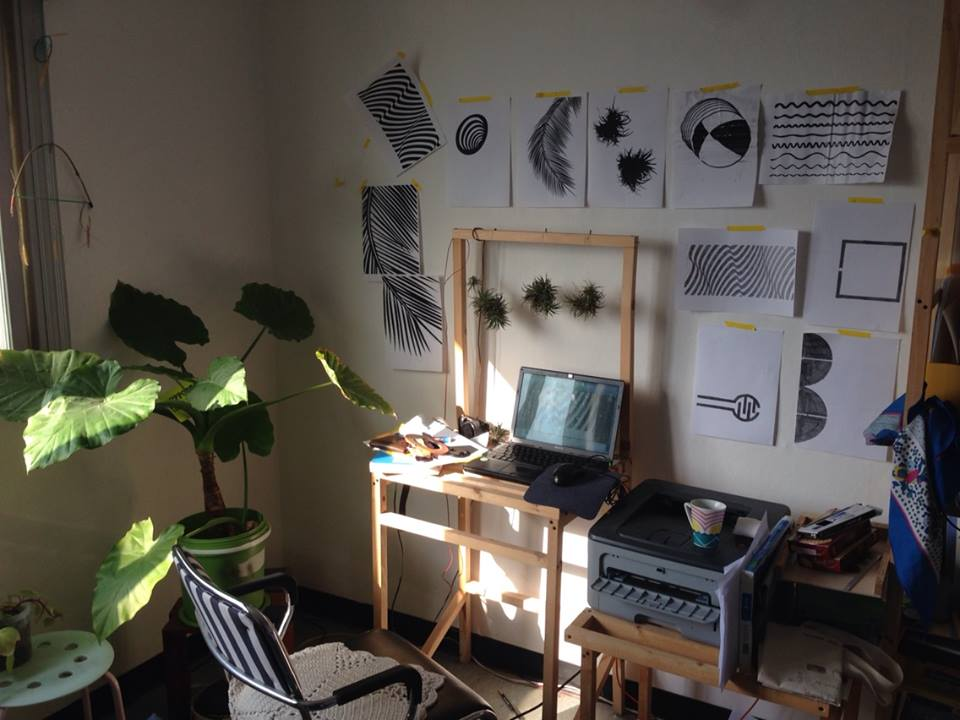

name: title
layout: true
class: center, blackwave, middle, title
---
name: content
layout: true
class: left, middle, blackwave, content
.footnote[oh-print / Printing Studio Show/ dianaband]
---
name: imgonly
layout: true
class: center, middle, blackwave, imgonly

.footnote[oh-print / Printing Studio Show/ dianaband]
---
layout: false
template: title
# 환영합니다

---
template: imgonly

---
template: imgonly

http://www.dianaband.info
---
template: imgonly

#사물의 소리, 공통감각
#--> 이미지와 소리에 대해 고민
# #소리가 파고 들 수 있는 빈공간이 있는 그래픽 이미지

---
template: imgonly
img src="data/image03.JPG" width=600>
---
template: imgonly
## 예전에는 이렇게 접근
##그래픽 이미지에 따른 전도성 물질의 물리적인 양 차이
##기하학 이미지

---
template: imgonly

##막바지 작업실 풍경

---
template: imgonly

###마로니에 공원에서 소규모 공연하는 사람들

---

template: content

