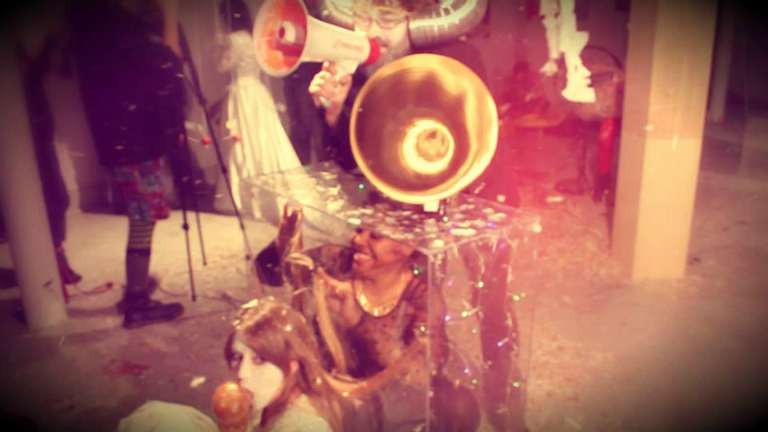

프란시스 알리스의 작업들 
이스라엘 접경지역 페인트통 뿌리고 다니기 
http://m.g-enews.com/ko-kr/news/article/sh/201412061121090127401_1/%27%EC%B1%84%EC%9B%80%27%EA%B3%BC+%27%EB%B9%84%EC%9B%80%27%EC%9D%98+%EC%A1%B0%ED%99%94%E2%80%A6%EC%9D%B8%EC%83%9D+%EC%97%AC%EC%A0%95%EC%9D%80+%EC%9D%B4%EB%9F%B0+%EA%B2%83%3F.html
얼음 옮기며 동네 걷기
https://www.youtube.com/watch?feature=player_embedded&v=ZedESyQEnMA
많은 사람들이 산을 옮기는 것 
http://ss.ize.kr/tag/Francis%20Alys

ALLORA & CALZADILLA 오토바이에 트럼펫
http://www.gladstonegallery.com/artist/allora-calzadilla/work#&panel1-11

순례길 처음 생각난게, 요아브의 작업이 제일 먼저 생각남 
http://www.yoavadmoni.com/#!circular-pilgrimage/c9ce

