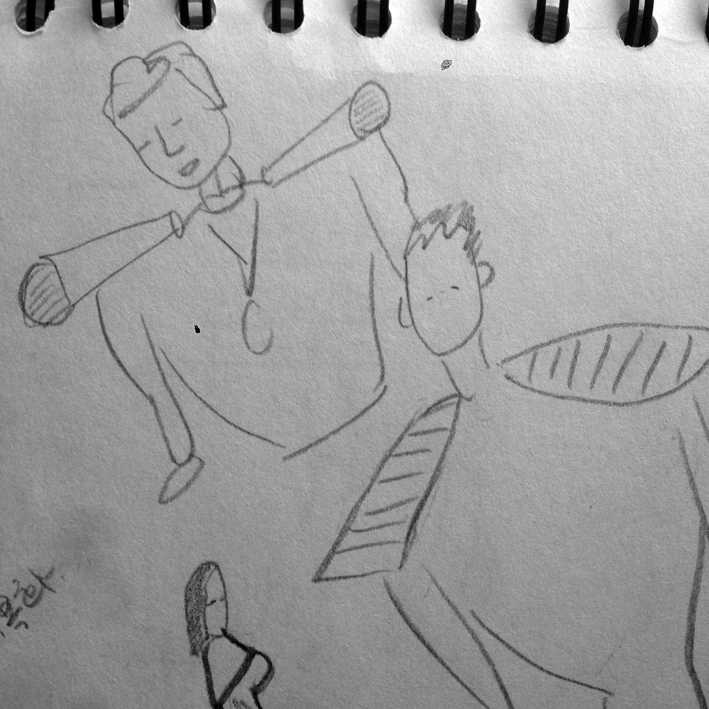

3번째 안산은 준비하면서. 좀 더 고민해야하는데. 

큰북 매고 다리로 북을 치는 사람처럼.. 도구가 의복화되는 상황 연구중

도레미파솔라시도 여덟가지 핸드벨(손에 쥐고 흔들어 음을 내는 악기)을 매고, 발걸음 한번 딛을 때마다 임의의 한 음이 소리난다 
혹은 동요나, 국가송이나 노래가 연주될수도 있을 꺼다 ... 
매캬닉과 일렉트로닉을 둘다 사용할지, 매캬닉으로만 구현할 수 있을지는 잘 모르겠다. 
일주일동안 무기력증과 함께 침잠해진 기분에 안산에서 무얼 할 수 있을지, 도무지 하고 싶은 것이 떠오르지 않아서 걱정을 많이 했는데. 
자연스럽게 마음을 풀어봤다. 서바이벌맨/ 메타 주제에 대해 깊이 생각하기 보다는 
하고 싶은 것이 뭘까 쭈욱 생각해보다가...
역시 걷는다는 것을 그 몸짓을 음으로 번역하고 싶은 마음이 크다 
걷는다는 것에 대한 지루함에서도 벗어날수도 있고 (서바이벌) 
요즘 광화문이나, 유선씨와 이달초부터 가게된 노들음악대에서나,,, 
사람들이 슬픔도 아니고 뭔가 무기력증, 회색의 냄세나는 공기 덩어리들을 만난다. 
부조리를 꺼내면서, 이런 회색 덩어리들과의 대면은 이번 작업에서 못하더라도, 적어도 걸으면서 나 스스로라도 힘을 주고 싶은게 솔직한 심정이기도 하다. 

사려고 마음 먹고 있는 가와이 핸드벨
http://item2.gmarket.co.kr/Item/DetailView/Item.aspx?goodscode=421378538
지금 국현에 핑퐁수레 윗부분에 달려있는 것과 동일하다고 생각하는데... 

프란시스 알리스의 작업들 
이스라엘 접경지역 페인트통 뿌리고 다니기 
http://m.g-enews.com/ko-kr/news/article/sh/201412061121090127401_1/%27%EC%B1%84%EC%9B%80%27%EA%B3%BC+%27%EB%B9%84%EC%9B%80%27%EC%9D%98+%EC%A1%B0%ED%99%94%E2%80%A6%EC%9D%B8%EC%83%9D+%EC%97%AC%EC%A0%95%EC%9D%80+%EC%9D%B4%EB%9F%B0+%EA%B2%83%3F.html
얼음 옮기며 동네 걷기
https://www.youtube.com/watch?feature=player_embedded&v=ZedESyQEnMA
많은 사람들이 산을 옮기는 것 
http://ss.ize.kr/tag/Francis%20Alys

ALLORA & CALZADILLA 오토바이에 트럼펫
http://www.gladstonegallery.com/artist/allora-calzadilla/work#&panel1-11

순례길 처음 생각난게, 요아브의 작업이 제일 먼저 생각남 
http://www.yoavadmoni.com/#!circular-pilgrimage/c9ce
