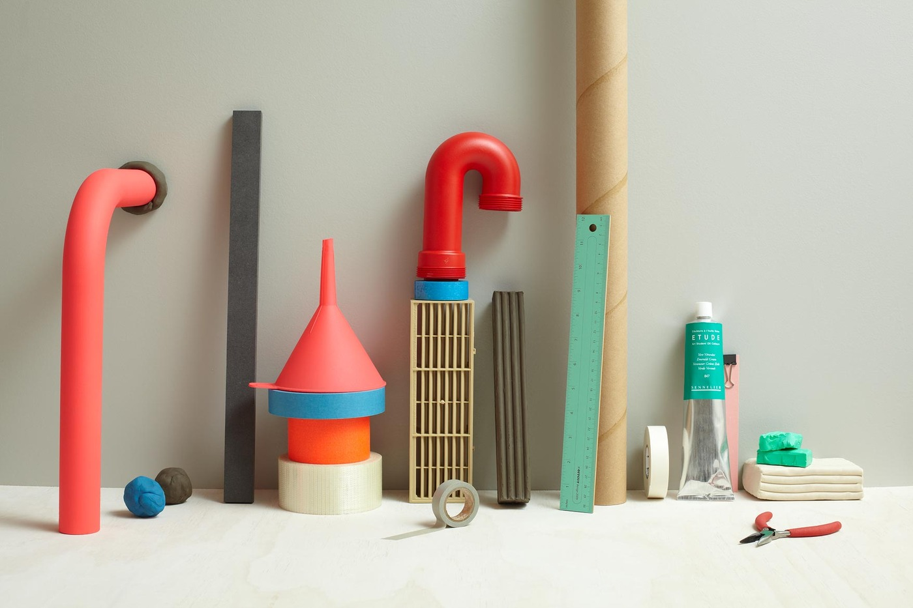

name: title
layout: true
class: center, blackwave, middle, title
---
name: content
layout: true
class: left, middle, blackwave, content
.footnote[show-me-how-to / 3nd project / share your knowledge]
---
name: imgonly
layout: true
class: center, middle, blackwave, imgonly

.footnote[show-me-how-to / 3nd project / share your knowledge]
---
layout: false
template: title
# show-me-how-to
#과정, 방법, 분해의 서사의 표현
##_3nd Project
### share your knowledge

---
template: content
# 프로젝트 소개, 훑어보기  
##경험, 지식을 시각언어로 공유하다 

##두가지 큰 방향 _ 두가지 중 하나 택일
##1. 과정, 방법 _ 음식 요리법, 매일 일어나서 규칙적으로 하는 행위 
##2. 사건, 사물의 구성요소 분해,  분류_ 전개도, 나열

##>> 구성요소별로, 시간 순서로, 혹은 일이 전개되는 추이로 쪼개어 보기 _ 관찰

---

template: content

##1. 과정, 방법 _

##자기가 아는 방법 
##종이접는 방법, 어떤 음식의 요리법, 빵구난 자전거 고치는 법
##골드버그 장치
##원미닛 비디오

---

template: imgonly

###과정, 방법

---
template: content

##2. 사건, 사물의 구성요소 분해,  분류

##자신이 항상 가지고 다니는 필기구
##애장품의 종류들 열거
##사물의 분해도 

---
template: imgonly

###분해, 분류

---
template: imgonly

###솔직한 발견, 호기심

---
template: imgonly

###솔직한 발견, 호기심

---
template: imgonly

###솔직한 발견, 호기심

---
template: imgonly

###솔직한 발견, 호기심

---
template: imgonly

###솔직한 발견, 호기심

---

template: content
#관찰 그리고 시선
#1. 일기 같이 접근해보는것도 좋고
#2. 낯설게 보기, 새롭게 보기 
#3. 일상의 풍경, 사람들에게 의외의 연상이미지를 덧붙여 작업
관찰 그리고 시선

---

template: content
#관찰 그리고 시선
#1. 일기 같이 접근해보는것도 좋고
##자주가는 가게 사람, 
##집까지 가는 길 관찰(시간순서를 넣어)
##매일 지나다니다 보면, 어떤날 특별한 사건이 발생할지도

##예를 들면, 

http://kerenpeng.com/Sketchbooks

http://kerenpeng.com/On-My-Way-Home

http://www.abouttoday.co.uk/Travel-Diaries

http://cargocollective.com/michellejchun/Cut-Outs

http://www.tipitin.com/shop/invasion-invasao-by-craig-atkinson

---

template: content
#관찰 그리고 시선
#2. 새롭게 보기 
## 관심 있는 열쇳말, 개념을 가지고 그것에 부합하는 것들만 찾아보기
##자주 출몰하는 고양이들, 강아지들 관찰하고 , 맵을 그려본다던지
##할머니 노숙자 여자들, 혹은 가방
##사람들(기준을 두고_옷잘입은 사람, 양복을 입는 사람, 오토바이타는 사람)
##특별한 풍경(철공소, 혹은 좁은 골목길)

##예를 들면, 

http://www.tizianajillbeck.de/indexhibit/index.php?/neu/casual-friday/

http://www.idnworld.com/creators/?id=GraceLee

http://www.masakokubo.co.uk/illustration/images/

---

template: content
#관찰 그리고 시선
#3. 일상의 풍경, 사람들에게 의외의 연상이미지를 덧붙여 작업
##전혀 다른 사람, 공간으로 상상하고 접근

##예를 들면, 
http://www.idnworld.com/creators/?id=JohnWoo

http://tinanded.com.au/projects/distant-colony/

http://tinanded.com.au/projects/united-eye/

http://palefroi.tumblr.com/

