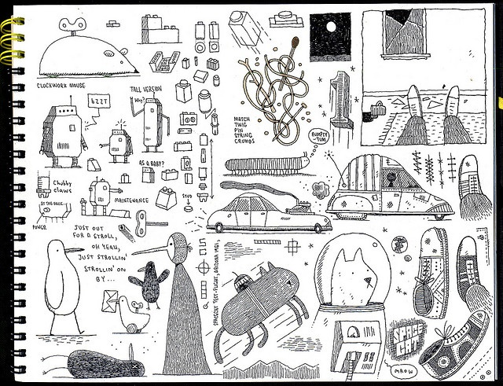

name: title
layout: true
class: center, blackwave, middle, title
---
name: content
layout: true
class: left, middle, blackwave, content
.footnote[show-me-how-to / 3nd project / share your knowledge]
---
name: imgonly
layout: true
class: center, middle, blackwave, imgonly

.footnote[show-me-how-to / 3nd project / share your knowledge]
---
layout: false
template: title
# show-me-how-to
#과정, 방법, 분해의 서사의 표현
##_3nd Project
### share your knowledge

---
template: content
# 프로젝트 소개, 훑어보기  
##경험, 지식을 시각언어로 공유하다 

##두가지 큰 방향 _ 두가지 중 하나 택일
##1. 과정, 방법 _ 음식 요리법, 매일 일어나서 규칙적으로 하는 행위 
##2. 사건, 사물의 구성요소 분해,  분류_ 전개도, 나열

##>> 구성요소별로, 시간 순서로, 혹은 일이 전개되는 추이로 쪼개어 보기 _ 관찰

---

template: content

##1. 과정, 방법 _

##자기가 아는 방법 
##종이접는 방법, 어떤 음식의 요리법, 빵구난 자전거 고치는 법
##골드버그 장치
##원미닛 비디오

---

template: imgonly

###과정, 방법

https://vimeo.com/77138894
---

template: imgonly

###과정, 방법

---

template: imgonly

###과정, 방법

---

template: imgonly

###과정, 방법

---

template: imgonly

###과정, 방법

---

template: imgonly

###과정, 방법

---

template: imgonly

###과정, 방법

---

template: imgonly

###과정, 방법

---

template: imgonly

###과정, 방법

---
template: content

##2. 사건, 사물의 구성요소 분해,  분류

##자신이 항상 가지고 다니는 필기구
##애장품의 종류들 열거
##사물의 분해도 

---
template: imgonly

###분해, 분류

---

template: imgonly

###분해, 분류

---
template: imgonly

###분해, 분류

---
template: imgonly

###분해, 분류

---
template: imgonly

###분해, 분류

---
template: imgonly

###분해, 분류

---

template: imgonly

###과정, 방법

---
template: imgonly

###분해, 분류

---
template: imgonly

###분해, 분류

---
template: imgonly

###분해, 분류

---
template: imgonly

###분해, 분류

---
template: imgonly

###분해, 분류

---
template: imgonly
## A2 사이즈 이상 크게 
##드로잉 위주, 사진 꼴라주 가능   -> 포스터 혹은 핸드북 형태 
##8컷 이상의  GiF _ 물론 출력본 -> 스

---
template: imgonly

http://willscobie.co.uk/

http://www.loop-the-loop.com/alphabet-prints/

http://www.youtube.com/watch?v=gI04Nrz364M#t=18

http://valleeduhamel.com/work/hermes-metamorphose/
