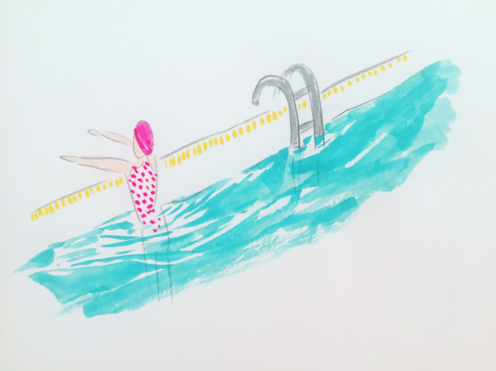

"위로의 모양"" 이라는 문구를 작년부터 생각해왔었다. 그냥 무심히 떠오른 문구인데, 오늘 생파공연을 위한 포스터를 만들다가 이 문구를 사용하고 싶다고 생각했다. 생일파티를 열어서 매년 살아 가고 있다는 걸 알리고 싶은 마음이 나이가 갈 수록 커지는 거 같다. 그것은 뭔가 한해 한해 살아 갈수록 새로운 경험, 사람, 음식, 내일이 점점 작아 지고 있는 느낌 때문이기도 하다. 그래서 일년의 하루라도, 내가 살아 가고 있다는 것에 대한 축하 및 위로를 해야한다고 생각했다. 그리고 이두호가 만들고 있는 dust 모티브의 사운드도 "위로의 모양"을 떠올리게 했다. 작은 것들 티끌 같은 것들이 모여서 모양을 만드는 것 같기도 하고, 이두호가 항상 작은 것들을 바라보는 소소하고 세심한 태도를 떠올려보면서, 이번 공연의 제목을 위로의 모양이라고 해야겠다는 결정하게 되었다.
이두호와 여러가지 작업을 해오고 있는데, 우리가 하는 것들이 위로라는 정서를 포함하고 있다는 생각이 오늘 아침 강하게 든다. 
올해는 "위로의 모양"이라는 이름으로 전시를 한번 해야하지 않을까? 

어렸을 때 같이 놀던 친구중에 구름다리를 아무렇지 않게 걸을 수 있는 친구가 있었다. 구름다리 건너는 거 무서워 나는 땅에서 그 친구의 자유로움을 바라봤고, 친구는 "너도 올라와" 말과 미소를 남기고 구름다리 넘어로 유유히 건너갔지. 지금 생각해보면, 앤 같은 친구다. 나를 다이애나라고 본다면(이두호 이론에 따르면) 성큼성큼 용기있게 건너가는 앤 같은 친구들이 다이애나의 소중한 친구지.

백구, 지영씨에게 그려준 인상. 전하고 싶은 청량감5

퇴근시간에 당산역에서 지하철안으로 많은 사람들이 밀려들어왔다. 서로 몸들이 엉켜붙어 비비고 같은 방향 겹겹히 밀려들어와있지만 같은 포즈로 다른 곳을 보고 화면 너머의 다른 친구와 손잡고 있으니까 이 순간의 부대낌, 불편함은 잊을 수 있는 거 같았다 겹겹이 사람 모습 인상적.

언메이크랩 종이접기 어려

모든 것이 이 한장의 프린트 때문에 꼬리에 꼬리를 물고 발생하는 것 같다. 
이 이미지 때문에 마이크 조명을 생각해냈다. 알록 달록한 발언. 그리고 조명 받음. 
말할래? 말해봐 부드럽게 유도하는 장치 같은 걸.
그러고 소리총을 만들었지. 그 사이에 그래피티 후라쉬도 만들었지. 

