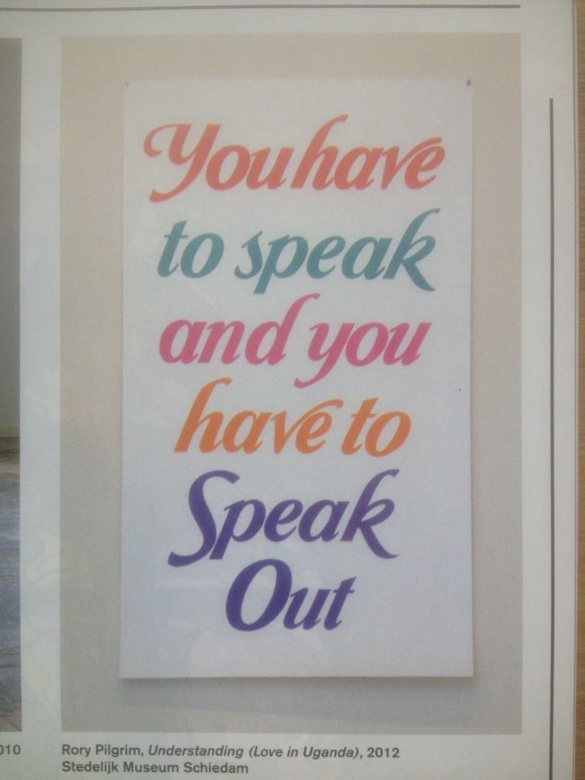

 모든 것이 이 한장의 프린트 때문에 꼬리에 꼬리를 물고 발생하는 것 같다. 

 

이 이미지 때문에 마이크 조명을 생각해냈다. 알록 달록한 발언. 그리고 조명 받음. 
말할래? 말해봐 부드럽게 유도하는 장치 같은 걸.
그러고 소리총을 만들었지. 그 사이에 그래피티 후라쉬도 만들었지. 

뭘 더 하고 싶은 걸까? 언메이크랩에서 
이두호와 어제 이야기 중에  우리는 제작과 행동 중에 두가지 다 취하면 좋지만 힘에 부칠경우 한가지에 방점을 두는 것이 좋을 수 있다고 햇다. 
행동을 제작하는 것도  가능하나. 그보다 제작, 개인이 무언걸 만드는 제작 에 집중하고. 
이두호가 제안했듯이 우리 모든걸 어렵게 생각하지 말고 쉽고 유연하게 하는 방향으로 생각한다면, 만드는 것에 집중하는 것이다. 

이것이 베를린에서 악기 만드는 섬머캠프 공고문
http://www.dock-berlin.de/?page_id=10
요것이. 
sound in the cloud  개념들을 좀 볼만 할 것 같고 
http://www.wolkenmusik.de/
이건 게임 하고 사람들이 자신들의 프로젝트를 할 수 있도록 유도하는 방법 좀 볼 만할 것 같고 
http://livingspaces.pixelache.ac/festivals/festival-2015/gaming-the-system
그리고 해커스앤디자이너스
http://hackersanddesigners.nl/
pret park
http://www.mediamatic.net/363388/en/pret-park

나는 자꾸 합일을 추구하는 것이 문제다. 작년에도 언메이크 랩에서 나는 어떻게 해야할지 조금 어려웠는데. 올해도 어렵다. 
내가 강박적으로 빈공간을 못 보는 사람이라 그런 거라 생각한다. 

우리의 작업하는 과정 방식이 어느정도 픽스되지 못 해서, 자꾸 워크숍하거나 청개구리 제작소와 무얼 한다는게 어렵게 느껴지는 걸지도. 
매번 모든게 어렵나 ㅠㅠ 

------------------

 
간디의 소금행
 